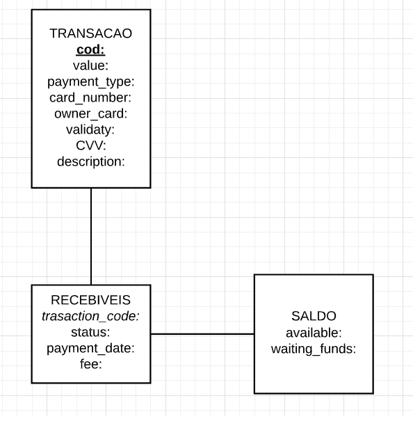

# Olá, bem-vindo ao meu repositório :sunglasses:
Encontrei esse desafio na conta do github da Pagar.me nesse [link](https://github.com/pagarme/vagas/tree/master/desafios/software-engineer-backend). Esse desafio me permitiu apriomar meus conhecimentos em JS e por em prática meus estudos sobre modelagem de dados.

#### Qual a linguagem de programação foi usada?
Unicamente Javascript.

#### Qual SGBD?
MySQL. Como consta na descrição do desafio, a empresa usa amplamente PostgreSQL, então utilizar um SGBD SQL me soou razoável. 
#### Estutura do projeto?

* Modelagem do banco de dados;
* Criação do banco de dados;
* Criação do script;
* Ajustes no banco de dados;
* Ajuste no script;
* Ajuste no banco de dados;
* Ajuste no script;
* Etc... (Provavelmente eu vou voltar nesse projeto para aperfeiçoá-lo)

#### Modelagem E Criação do banco de dados
Eu decidi criar um diagrama entidade-relacionamento para organizar melhor as idéias.

#### Criação do Script
Como pode ver, para acessar o banco de dados MySQL criei um script chamado *db.js* que tem como única atribuição realizar os comandos SQL. As funções das aplicações são executados no script *index.js*.
#### Como executar o script
* Crie um banco de dados MySQL com a mesma estrutura;
* Clonar o repositório e dar `npm install`
* Preencha a conexão o db.js com as credenciais do seu banco de dados
* Acesse o diretório `view` e abra o arquivo `index.html`
* Inicie o servidor com o comando `node server.js` na raiz do projeto
* Brinque a vontade;

Volto daqui algum tempo com melhorias :)
